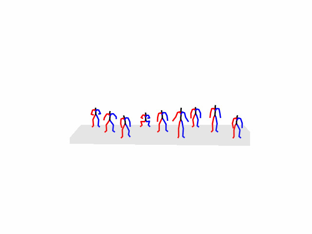

# T2M-GPT with SMPL Motion Generation

This repository contains a modified version of the T2M-GPT code for generating motions and `.npy` files compatible with the SMPL (Skinned Multi-Person Linear model) model. The original code can be found [here](https://github.com/Mael-zys/T2M-GPT).

## Demo
You can see a demo of the generated motion in the following GIF:
  
prompt: A person squat to carry up something.
## Contributors

- [Gunwoo Yong](https://github.com/gwyong)
- [Leyang Wen](https://github.com/LeyangWen)
- [Francis Baek]